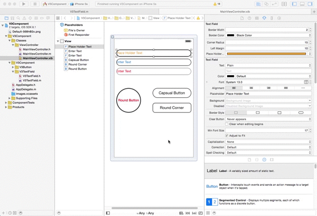

V3Component
===========
###You can change following options directly from the interface builder

# Features for V3TextField
###  1.  BorderWidth
###  2.  BorderColor
###  3.  CornerRadius
###  4.  Left Margin
###  5.  Place Holder Color

# Features for V3Button
###  1.  BorderWidth
###  2.  BorderColor
###  3.  CornerRadius

##Normal Installation

  1. Download the zip file. 
  2. Add **V3Component** Folder to your workspace
  3. Select 'Copy items if needed' option

